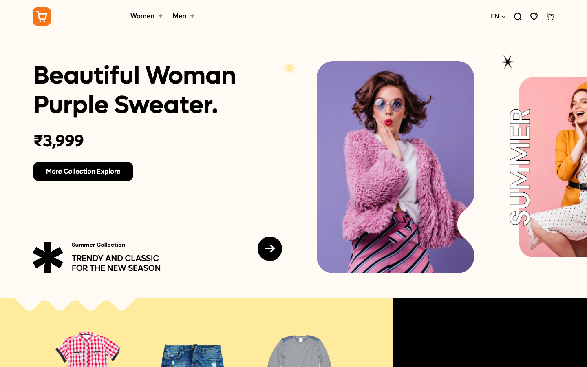
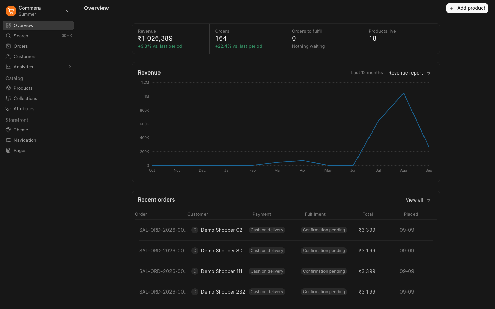

<div align="center" markdown="1">


<h1>Commera</h1>

**Open source storefront and merchant dashboard for ERPNext**

<div>
	
</div>

</div>

## Commera

Commera turns an ERPNext site into a complete online shop. Shoppers get a fast, bilingual, themeable storefront rendered server-side; the people running the shop get a modern dashboard built with Vue 3 and frappe-ui. ERPNext stays the system of record underneath, so stock, pricing, tax and accounting are never a second copy that drifts.

### Motivation

Most ERPNext storefronts make you choose. Either you take a server-rendered portal that is quick and SEO-friendly but painful to administer, or you bolt on a separate storefront platform and spend the rest of the project reconciling two catalogues, two stock counts and two sets of orders.

Commera refuses that trade. The storefront is Jinja, Tailwind and Alpine — no SPA payload between a shopper and a product page — while the merchant side is a proper single-page app that feels like the commerce tools people already use. Both read and write the same ERPNext documents.

### The merchant dashboard

<div>
	
</div>

A Vue 3 + [frappe-ui](https://github.com/frappe/frappe-ui) app served at `/commera`, and registered on the desk apps screen so it sits alongside ERPNext.

- **Overview** — revenue, order counts and what needs fulfilling, against the previous period
- **Orders** — filter by unfulfilled, unpaid, open or closed; drill into payment and fulfilment state per order
- **Products** — templates, variants, pricing and inventory, including bulk publishing and bulk image upload
- **Customers, Collections and Attributes** — the catalogue structure, editable without touching the desk
- **Analytics** — revenue, inventory and first-party storefront funnels
- **Storefront** — switch theme, build the navigation menu, and edit content pages with live preview

### Key features

- **Bilingual, RTL-ready storefront.** URL-based language switching (`/en/`, `/ar/`) on Frappe's native translation system, with right-to-left layout handled throughout rather than patched on.

- **Themeable without forking.** Themes are data: a `Shop Theme` record plus a template directory. A theme declares its own routes, may require auth per route, and can override any page the app ships — so a shop can restyle checkout without maintaining a fork.

- **Style Attribute Configurator.** Model a garment once as a template with colour and size attributes, then generate and publish its variants in bulk instead of hand-creating each SKU.

- **Payments.** Razorpay, Stripe, Telr and Tabby (BNPL) through [bwh_payments](https://github.com/bwhtech/bwh_payments), plus cash on delivery. Gateway callbacks are idempotent, so a replayed webhook racing a shopper's return cannot bill twice.

- **Shipping.** Shiprocket and AfterShip through [bwh_shipping](https://github.com/bwhtech/bwh_shipping), with delivery options, parcels and tracking events on the order.

- **Returns and refunds.** Return reasons, return delivery notes and partial refunds booked back through ERPNext.

- **Search.** A configurable index over the catalogue with per-field content and result mapping, rebuilt nightly.

- **SEO and AI discoverability.** Per-page metadata, generated `sitemap.xml`, `llms.txt`, and Open Graph images rendered from templates at request time.

- **Analytics.** First-party storefront events stored on the site, plus GA4 and Meta pixel integration and custom tracking scripts.

- **Merchandising.** Landing page hero banners, promo banners, recommended variants, size charts and back-in-stock notifications.

### Under the hood

- [Frappe Framework](https://github.com/frappe/frappe) — full-stack Python web framework
- [ERPNext](https://github.com/frappe/erpnext) — stock, pricing, tax and accounting
- [Frappe UI](https://github.com/frappe/frappe-ui) — Vue 3 component library for the dashboard
- Jinja, [Tailwind CSS](https://tailwindcss.com) and [Alpine.js](https://alpinejs.dev) for the storefront

## Compatibility

| Commera branch | Stability   | Frappe branch | ERPNext branch |
| :------------- | :---------- | :------------ | :------------- |
| main           | stable      | v16.x & above | v16.x & above  |
| develop        | maintenance | v15.x         | v15.x          |

Commera requires Python 3.11 or newer.

## Installation

Commera needs ERPNext plus its two companion apps. From your bench:

```bash
bench get-app https://github.com/bwhtech/bwh_payments
bench get-app https://github.com/bwhtech/bwh_shipping
bench get-app https://github.com/bwhtech/commera

bench --site your-site.localhost install-app erpnext
bench --site your-site.localhost install-app bwh_payments
bench --site your-site.localhost install-app bwh_shipping
bench --site your-site.localhost install-app commera

# Themes live in the module tree and only sync on migrate, never on install-app.
bench --site your-site.localhost migrate
bench build --app commera
```

Then open `/commera` on your site to reach the dashboard, and `/en` for the storefront.

### Seeding a demo store

To see a populated shop rather than an empty one:

```bash
bench --site your-site.localhost execute commera.install_pixio_demo.install_pixio_demo
```

That seeds the catalogue, theme, navigation, footer and a period of storefront analytics. It is safe to re-run.

## Development

```bash
# storefront CSS
npm install
npm run tailwind:watch

# merchant dashboard
cd dashboard && npm install && npm run dev
```

Run the test suite against a site with `allow_tests` enabled:

```bash
bench --site your-site.localhost set-config allow_tests true
bench --site your-site.localhost run-tests --app commera
```

## About BWH Studios

Commera is developed and maintained by BWH Studios, a tech company based in Jagdalpur, Chhattisgarh, specializing in Frappe customizations and consulting.

---

⭐ If you find Commera helpful, please consider starring the repository!
